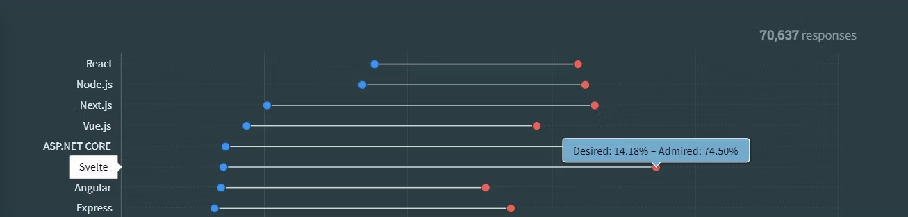

# Salmon Cookies

## Problem Domain

The goal of this project is to recreate a website for a fictional company called Salmon Cookies using a new framework to the developers. Svelte can be paired with other technologies such as Vite, Material UI and many more.  Svelte was the framework chosen as the technology to redesign the application. The application is a cookie sales website that allows the user to add new stores, and view the sales data for each store. The application also allows the user to add new stores to the website.

## General Comments

Svelte offers an easy front end experience. It is a great framework for developers who want to build small applications quickly; great for prototyping! This is because Svelte has a unique solution that brings JavaScript, CSS, and HTML to one document. Once working with Svelte, there is close connection to working with regular old HTML, but in the new and innovative way. That unification can also be a recipe for confusion when building large applications.

### Pros

- Svelte is a very easy framework to learn and use. Follow this [tutorial](https://learn.svelte.dev/tutorial/welcome-to-svelte) to quickly get acquainted with the framework.
- It shares many similarities to React in its syntax and structure.
- It is a great framework for building small applications.
- Amazing for quickly building prototypes.

### Cons

- Svelte is a very new framework and is still in its infancy, so community help is limited.
- It can get very messy when building large applications.
- Some syntax are not very intuitive and can be confusing.

## Ratings and Reviews

### Documentation

[Documentation can be found here](https://svelte.dev/docs/introduction)

### Systems Requirements

Apart from the basic dependencies of Node.js and a compatible operating system, Svelte itself does not have any specific dependencies or core requirements.

## Ramp-Up Projections

Based on the experience we had with Svelte, it is save to say a team of mid-junior devs to take less than 3 days to get up to speed with the framework and be able to provide value to the team.

## Community Support and Adoption levels

Its adoption levels have mixed reviews. [This article](https://www.makeuseof.com/most-popular-javascript-frameworks/) shows the reviews the framework has received. While it is one of less desired frameworks, it is the MOST ADMIRED!

The framework is generally new but quickly gaining popularity with a growing fan base. Community page can be found [here](https://sveltesociety.dev/).
